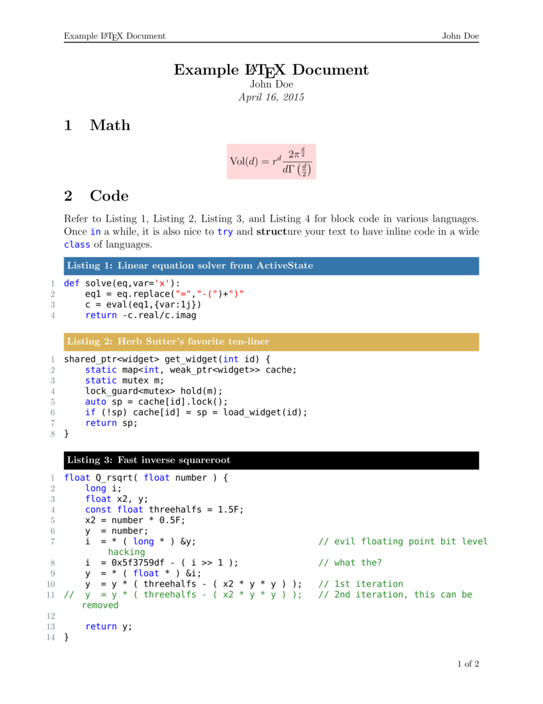
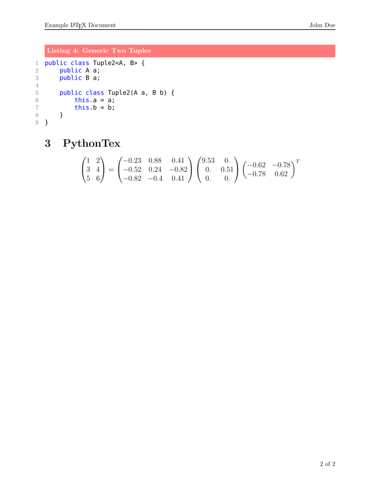

# texmf #

This tex and metafont repository contains a miscellany of latex packages, some
home made and some pulled from third parties. It also contains a set of scripts
dedicated to making LaTeX compilation a more enjoyable experience. 

## knuth and texmake ##
knuth is wrapper for a conjunction of pdflatex and pythontex. Some examples.

    knuth build foo.tex
    knuth build --ipython foo.tex
    knuth clean
    knuth clean --keep-pdf
    knuth sanitize
    knuth sanitize --keep-pdf
    knuth makefile foo.tex

For more information, please consult `scripts/knuth`.

## Example ##

## Installation ##
Please read `install.sh`
