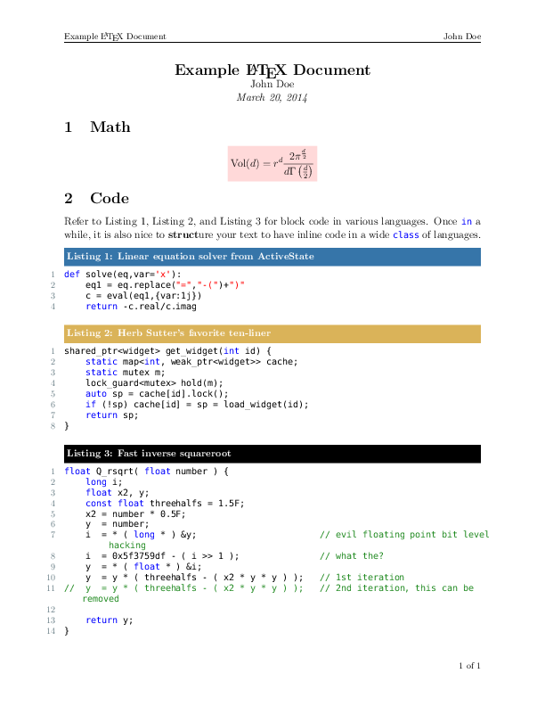

# texmf #

This tex and metafont repository contains a miscellany of latex packages, some
home made and some pulled from third parties. It also contains a set of scripts
dedicated to making LaTeX compilation a more enjoyable experience. 

## Packages ##
- **hw.cls** The homework document class is a general purpose package for
  homework. With a redefined `\maketitle`, fancy headers and footers, and a few
  other tweaks, hw.cls is minimal upgrade to the article class.
- **code.sty** The code package offers beautiful syntax highlighting for the
  following languages.
    - python
    - C++
    - C

## knuth and texmake ##
knuth is wrapper for a conjunction of pdflatex and pythontex. To compile a
latex document, say foo.tex, run

    knuth foo.tex

To clean up after knuth's mess, run

    knuth clean

Note that knuth will internally call pythontex. This implies that a successful
compilation is contingent on `\usepackage{pythontex}`.

Alternatively, texmake can streamline the compilation further. texmake is a
simple Makefile maker. To generate a Makefile for foo.tex, run

    texmake foo > Makefile

Now, we can run `make` to make foo.tex and `make clean` to clean up knuth's
output files.

## Example ##

## Installation ##
Please read `install.sh`
